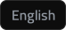
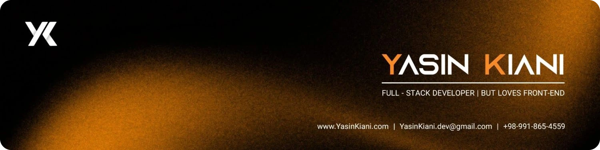
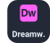

  
  

  

  

  
  

<picture>
  <source media="(prefers-color-scheme: dark)" srcset="assets/text/h-about-fa-dark.svg" />
  
</picture>

سلام! من **یاسین کیانی** هستم؛ **برنامه‌نویس فول‌استک** و **مهندس نرم‌افزار** از **اصفهان**. بیشترین علاقه‌ام به فرانت‌اند است؛ جایی که طراحی و برنامه‌نویسی به هم می‌رسند و حاصل کار، همان چیزی است که کاربر می‌بیند و با آن کار می‌کند.

وب‌سایت و وب‌اپلیکیشن، قالب و افزونه وردپرس، اپلیکیشن اندروید و نرم‌افزارهای داده‌محور می‌سازم. در هر پروژه دو چیز برایم مهم است: **کدی خوانا و قابل نگهداری**، و **تجربه‌ای ساده و دلنشین** برای کسی که از آن استفاده می‌کند.

&nbsp; **در یک نگاه**

- این روزها روی پلتفرم‌های وب، افزونه‌های وردپرس، اپلیکیشن‌های اندروید و ابزارهای مبتنی بر هوش مصنوعی کار می‌کنم.
- مهارتم را در یادگیری ماشین، بینایی ماشین و سئو به کمک هوش مصنوعی گسترش می‌دهم.
- از همکاری در **پروژه‌های متن‌باز** همیشه استقبال می‌کنم.
- زبان‌ها: فارسی (زبان مادری) و انگلیسی

<picture>
  <source media="(prefers-color-scheme: dark)" srcset="assets/text/h-education-fa-dark.svg" />
  
</picture>

| مقطع | رشته | محل تحصیل |
|---|---|---|
| **کارشناسی** | مهندسی حرفه‌ای کامپیوتر نرم‌افزار | دانشکده فنی و حرفه‌ای شهید محسن مهاجر اصفهان دانشگاه ملی مهارت (فنی و حرفه‌ای سابق) |
| **کاردانی** | کامپیوتر – نرم‌افزار | دانشکده فنی و حرفه‌ای شهید محسن مهاجر اصفهان دانشگاه ملی مهارت (فنی و حرفه‌ای سابق) |

<picture>
  <source media="(prefers-color-scheme: dark)" srcset="assets/text/h-competencies-fa-dark.svg" />
  
</picture>

| حوزه | کاری که انجام می‌دهم |
|---|---|
| **توسعه وب** | وب‌سایت و وب‌اپلیکیشن مدرن و واکنش‌گرا؛ از رابط کاربری تا سرور و پایگاه داده |
| **فرانت‌اند و UI/UX** | رابط‌های کاربری شفاف، دسترس‌پذیر و چشم‌نواز؛ بخشی از کار که بیش از همه دوستش دارم |
| **وردپرس** | طراحی قالب، افزونه و ابزارک‌های اختصاصی المنتور |
| **مهندسی نرم‌افزار** | منطق برنامه با ساختاری اصولی، الگوریتم‌ها و نرم‌افزارهای دسکتاپ |
| **توسعه اندروید** | اپلیکیشن‌های Java با SQLite، متریال دیزاین و پشتیبانی کامل از راست‌چین |
| **هوش مصنوعی و بینایی ماشین** | تشخیص چهره، یادگیری ماشین و به‌کارگیری هوش مصنوعی در فرایند توسعه |
| **پایگاه داده و معماری سیستم** | طراحی پایگاه داده و فرایندهای امن و کارآمد |

<picture>
  <source media="(prefers-color-scheme: dark)" srcset="assets/text/h-stack-fa-dark.svg" />
  
</picture>

<picture>
  <source media="(prefers-color-scheme: dark)" srcset="assets/text/l-languages-fa-dark.svg" />
  
</picture>

  &nbsp;&nbsp;&nbsp;&nbsp;&nbsp;

<picture>
  <source media="(prefers-color-scheme: dark)" srcset="assets/text/l-frontend-fa-dark.svg" />
  
</picture>

  &nbsp;&nbsp;&nbsp;&nbsp;&nbsp;&nbsp;&nbsp;&nbsp;&nbsp;

<picture>
  <source media="(prefers-color-scheme: dark)" srcset="assets/text/l-backend-fa-dark.svg" />
  
</picture>

  &nbsp;&nbsp;

<picture>
  <source media="(prefers-color-scheme: dark)" srcset="assets/text/l-databases-fa-dark.svg" />
  
</picture>

  &nbsp;&nbsp;&nbsp;&nbsp;

<picture>
  <source media="(prefers-color-scheme: dark)" srcset="assets/text/l-wordpress-fa-dark.svg" />
  
</picture>

  &nbsp;

<picture>
  <source media="(prefers-color-scheme: dark)" srcset="assets/text/l-mobile-fa-dark.svg" />
  
</picture>

  &nbsp;&nbsp;

<picture>
  <source media="(prefers-color-scheme: dark)" srcset="assets/text/l-design-fa-dark.svg" />
  
</picture>

  &nbsp;&nbsp;&nbsp;&nbsp;

<picture>
  <source media="(prefers-color-scheme: dark)" srcset="assets/text/l-ai-fa-dark.svg" />
  
</picture>

  &nbsp;&nbsp;&nbsp;

<picture>
  <source media="(prefers-color-scheme: dark)" srcset="assets/text/l-seo-fa-dark.svg" />
  
</picture>

  &nbsp;

<picture>
  <source media="(prefers-color-scheme: dark)" srcset="assets/text/l-tools-fa-dark.svg" />
  
</picture>

  &nbsp;&nbsp;&nbsp;&nbsp;&nbsp;

<picture>
  <source media="(prefers-color-scheme: dark)" srcset="assets/text/l-industry-fa-dark.svg" />
  
</picture>

  &nbsp;&nbsp;

<picture>
  <source media="(prefers-color-scheme: dark)" srcset="assets/text/h-stats-fa-dark.svg" />
  
</picture>

  

  
  

<picture>
  <source media="(max-width: 480px) and (prefers-color-scheme: dark)" srcset="https://raw.githubusercontent.com/YasinKiani/YasinKiani/output/github-snake-mobile-dark.svg" />
  <source media="(max-width: 480px)" srcset="https://raw.githubusercontent.com/YasinKiani/YasinKiani/output/github-snake-mobile.svg" />
  <source media="(prefers-color-scheme: dark)" srcset="https://raw.githubusercontent.com/YasinKiani/YasinKiani/output/github-snake-dark.svg" />
  
</picture>

<picture>
  <source media="(prefers-color-scheme: dark)" srcset="assets/text/h-connect-fa-dark.svg" />
  
</picture>

  
  
  
  
  
  
  
  
  
  

  <b dir="ltr">www.YasinKiani.com</b> &nbsp;|&nbsp; <b dir="ltr">yasinkiani.dev@gmail.com</b> &nbsp;|&nbsp; <b dir="ltr">+98&nbsp;991&nbsp;865&nbsp;4559</b>

<!-- live profile-view counter (read daily by the workflow to draw the views badge) -->

