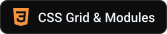
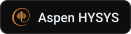
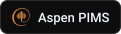
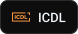

  

  
  

  

  
  
  
  

<picture>
  <source media="(prefers-color-scheme: dark)" srcset="assets/text/h-about-fa-dark.svg" />
  
</picture>

من **یاسین کیانی** هستم؛ **توسعه‌دهنده فول‌استک** و **مهندس نرم‌افزار** ساکن **اصفهان** که علاقه ویژه‌ای به فرانت‌اند دارم. پلتفرم‌های وب، اپلیکیشن‌های اندروید و نرم‌افزارهای داده‌محور می‌سازم؛ از رابط‌های کاربری زیبا و واکنش‌گرا تا معماری‌های بک‌اند مقیاس‌پذیر.

کار من جایی است که **طراحی بصری و منطق مهندسی** به هم می‌رسند. در هر پروژه‌ای تمرکزم روی **کد تمیز و قابل نگهداری** و **تجربه کاربری روان** است.

&nbsp; **تحصیلات**

- **کارشناسی** مهندسی حرفه‌ای کامپیوتر – نرم‌افزار
- **کاردانی** نرم‌افزار کامپیوتر
- دانشگاه ملی مهارت (فنی و حرفه‌ای سابق) — *دانشکده فنی شهید محسن مهاجر اصفهان*

&nbsp; **در یک نگاه**

- ساخت پلتفرم‌های وب، اپلیکیشن‌های اندروید و ابزارهای مبتنی بر هوش مصنوعی
- فعالیت در زمینه یادگیری ماشین، بینایی ماشین و سئو با هوش مصنوعی
- آماده همکاری در **پروژه‌های متن‌باز**
- زبان‌ها: فارسی (زبان مادری)، انگلیسی

<picture>
  <source media="(prefers-color-scheme: dark)" srcset="assets/text/h-competencies-fa-dark.svg" />
  
</picture>

| حوزه | تمرکز |
|---|---|
| **توسعه وب** | وب‌سایت‌ها و وب‌اپلیکیشن‌های فول‌استک، مدرن و واکنش‌گرا |
| **فرانت‌اند و UI/UX** | رابط‌های کاربری ساده، دسترس‌پذیر و جذاب — بخش مورد علاقه من |
| **مهندسی نرم‌افزار** | منطق برنامه مقیاس‌پذیر، الگوریتم‌ها و نرم‌افزارهای دسکتاپ |
| **توسعه اندروید** | اپلیکیشن‌های بومی Java با SQLite، متریال دیزاین و رابط راست‌چین |
| **هوش مصنوعی و بینایی ماشین** | تشخیص چهره، یادگیری ماشین و گردش‌کارهای مبتنی بر هوش مصنوعی |
| **معماری سیستم** | طراحی گردش‌کارهای امن و بهینه و طراحی پایگاه داده |

<picture>
  <source media="(prefers-color-scheme: dark)" srcset="assets/text/h-stack-fa-dark.svg" />
  
</picture>

<picture>
  <source media="(prefers-color-scheme: dark)" srcset="assets/text/l-languages-fa-dark.svg" />
  
</picture>

  

<picture>
  <source media="(prefers-color-scheme: dark)" srcset="assets/text/l-frontend-fa-dark.svg" />
  
</picture>

  

<picture>
  <source media="(prefers-color-scheme: dark)" srcset="assets/text/l-backend-fa-dark.svg" />
  
</picture>

  

<picture>
  <source media="(prefers-color-scheme: dark)" srcset="assets/text/l-mobile-fa-dark.svg" />
  
</picture>

  

<picture>
  <source media="(prefers-color-scheme: dark)" srcset="assets/text/l-design-fa-dark.svg" />
  
</picture>

  

<picture>
  <source media="(prefers-color-scheme: dark)" srcset="assets/text/l-more-fa-dark.svg" />
  
</picture>

 

  
  
  
  
  
  
  
  
  
  
  
  
  
  

<picture>
  <source media="(prefers-color-scheme: dark)" srcset="assets/text/h-stats-fa-dark.svg" />
  
</picture>

  

  
  

<picture>
  <source media="(prefers-color-scheme: dark)" srcset="https://raw.githubusercontent.com/YasinKiani/YasinKiani/output/github-snake-dark.svg" />
  
</picture>

<picture>
  <source media="(prefers-color-scheme: dark)" srcset="assets/text/h-connect-fa-dark.svg" />
  
</picture>

  
  
  
  
  
  
  
  
  
  

  <b>www.YasinKiani.com</b> &nbsp;|&nbsp; <b>yasinkiani.dev@gmail.com</b> &nbsp;|&nbsp; <b dir="ltr">+98&nbsp;991&nbsp;865&nbsp;4559</b>

<!-- live profile-view counter (read daily by the workflow to draw the views badge) -->

