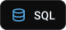

  
  

  

  

  
  

<picture>
  <source media="(prefers-color-scheme: dark)" srcset="assets/text/h-about-en-dark.svg" />
  
</picture>

Hi, I'm **Yasin Kiani**, a **Full-Stack Developer** and **Software Engineer** from **Isfahan, Iran**. I work across the whole product, but the front-end is where my heart is. I build websites and web applications, Android apps and data-driven software, from polished, responsive interfaces to reliable, scalable back-ends.

For me, every project is where **design meets engineering**: it should look good, and the code behind it should be **clean, readable and easy to maintain**. My goal is always the same: people should get their work done without having to think about the tool.

&nbsp; **At a Glance**

- Designing and building web platforms, Android apps and AI-powered tools
- Working with machine learning, computer vision and AI-driven SEO
- Experienced with process simulation and refinery planning software for the oil, gas and petrochemical industries
- Open to collaboration on **open-source projects**
- Languages: Persian (native), English

<picture>
  <source media="(prefers-color-scheme: dark)" srcset="assets/text/h-education-en-dark.svg" />
  
</picture>

| Degree | Field of Study | University |
|---|---|---|
| **Bachelor of Science (B.Sc.)** | Professional Computer Engineering – Software | National University of Skills (formerly Technical and Vocational University) – Shahid Mohsen Mohajer Technical and Vocational College, Isfahan |
| **Associate Degree** | Computer Software (continuous program) | National University of Skills (formerly Technical and Vocational University) – Shahid Mohsen Mohajer Technical and Vocational College, Isfahan |

**Certificates**

&nbsp; **ICDL** – International Computer Driving Licence

<picture>
  <source media="(prefers-color-scheme: dark)" srcset="assets/text/h-competencies-en-dark.svg" />
  
</picture>

| Area | What I Do |
|---|---|
| **Web Development** | Modern, fast and responsive websites and web applications, from the interface to the server and database |
| **Front-End & UI/UX** | Clear, accessible and enjoyable user interfaces, the part of the work I love most |
| **WordPress** | Building and managing WordPress sites, and developing custom themes, plugins and Elementor widgets |
| **Software Engineering** | Application logic, algorithms and desktop software with a scalable structure |
| **Android Development** | Native Java apps with SQLite, Material Design and full right-to-left support |
| **AI & Computer Vision** | Face recognition, machine learning, and AI in development and SEO workflows |
| **Databases & System Design** | Database design and secure, efficient and reliable workflows |
| **Oil, Gas & Petrochemicals** | Process simulation and refinery planning with Aspen HYSYS, KBC Petro-SIM and Aspen PIMS |

<picture>
  <source media="(prefers-color-scheme: dark)" srcset="assets/text/h-stack-en-dark.svg" />
  
</picture>

<table>
<tr>
<td width="50%" valign="top" align="left">
<picture><source media="(prefers-color-scheme: dark)" srcset="assets/text/l-languages-en-dark.svg" /></picture> 
 

</td>
<td width="50%" valign="top" align="left">
<picture><source media="(prefers-color-scheme: dark)" srcset="assets/text/l-frontend-en-dark.svg" /></picture> 
 
 
</td>
</tr>
<tr>
<td width="50%" valign="top" align="left">
<picture><source media="(prefers-color-scheme: dark)" srcset="assets/text/l-backend-en-dark.svg" /></picture> 

</td>
<td width="50%" valign="top" align="left">
<picture><source media="(prefers-color-scheme: dark)" srcset="assets/text/l-databases-en-dark.svg" /></picture> 
 

</td>
</tr>
<tr>
<td width="50%" valign="top" align="left">
<picture><source media="(prefers-color-scheme: dark)" srcset="assets/text/l-wordpress-en-dark.svg" /></picture> 
 
 
</td>
<td width="50%" valign="top" align="left">
<picture><source media="(prefers-color-scheme: dark)" srcset="assets/text/l-mobile-en-dark.svg" /></picture> 
 

</td>
</tr>
<tr>
<td width="50%" valign="top" align="left">
<picture><source media="(prefers-color-scheme: dark)" srcset="assets/text/l-design-en-dark.svg" /></picture> 
 

</td>
<td width="50%" valign="top" align="left">
<picture><source media="(prefers-color-scheme: dark)" srcset="assets/text/l-ai-en-dark.svg" /></picture> 
 
  
</td>
</tr>
<tr>
<td width="50%" valign="top" align="left">
<picture><source media="(prefers-color-scheme: dark)" srcset="assets/text/l-seo-en-dark.svg" /></picture> 
 
</td>
<td width="50%" valign="top" align="left">
<picture><source media="(prefers-color-scheme: dark)" srcset="assets/text/l-tools-en-dark.svg" /></picture> 
 
 
</td>
</tr>
<tr>
<td colspan="2" valign="top" align="left">
<picture><source media="(prefers-color-scheme: dark)" srcset="assets/text/l-industry-en-dark.svg" /></picture> 
  
</td>
</tr>
</table>

<picture>
  <source media="(prefers-color-scheme: dark)" srcset="assets/text/h-stats-en-dark.svg" />
  
</picture>

  

  
  

<picture>
  <source media="(max-width: 480px) and (prefers-color-scheme: dark)" srcset="https://raw.githubusercontent.com/YasinKiani/YasinKiani/output/github-snake-mobile-dark.svg" />
  <source media="(max-width: 480px)" srcset="https://raw.githubusercontent.com/YasinKiani/YasinKiani/output/github-snake-mobile.svg" />
  <source media="(prefers-color-scheme: dark)" srcset="https://raw.githubusercontent.com/YasinKiani/YasinKiani/output/github-snake-dark.svg" />
  
</picture>

<picture>
  <source media="(prefers-color-scheme: dark)" srcset="assets/text/h-connect-en-dark.svg" />
  
</picture>

  
  
  
  
  
  
  
  
  
  

  <b dir="ltr">www.YasinKiani.com</b> &nbsp;|&nbsp; <b dir="ltr">yasinkiani.dev@gmail.com</b> &nbsp;|&nbsp; <b dir="ltr">+98&nbsp;991&nbsp;865&nbsp;4559</b>

<!-- live profile-view counter (read daily by the workflow to draw the views badge) -->

